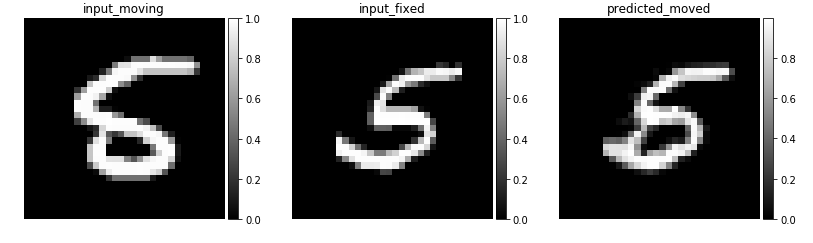
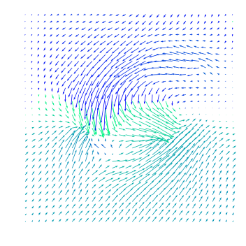
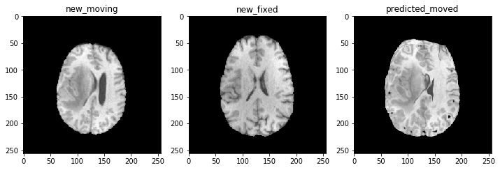
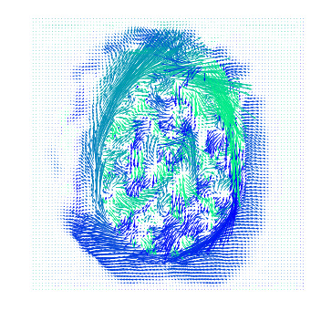

<h1 style="text-align:center"> Brain Tumor 2D Image Registration </h1>


The goal of this project is to use a CNN based registration algorithm to align 2D brain images of patients with brain glioblastoma to a healthy template. We will use the freely available dataset [Brats]( http://braintumorsegmentation.org/) and [VoxeMorph](https://github.com/voxelmorph/voxelmorph), a state-of-the-art deep learning registration algorithm.

## Prerequisites
You need to install TensorFlow 1.13.1 and Voxelmorph module 
- Installing TensorFlow with conda 
    
```console
    $ conda create -n tensorflow pip python=3.5
    $ activate tensorflow
    $ pip install --ignore-installed --upgrade tensorflow
```
- Installing Voxelmorph
 ```console
    $ pip install voxelmorph
```


# Notes on Data
We used publically available data, but unfortunately we cannot redistribute it (due to the constraints of those datasets). We put in DataSample folder some samples from the dataset that we are allowed to share in order to be able to use the notebook and run it.

We encourage users to download and process their own data. See [a list of medical imaging datasets here](https://github.com/adalca/medical-datasets). 

## Registration

If you simply want to register two images, you can use the register.py script with the desired model file. For example, if we have a model model.h5 trained to register a subject (moving) to an atlas (fixed), we could run:

 ```console
 ./TensorFlow/voxelmorph/src/register.py --moving moving.nii.gz --fixed atlas.nii.gz --moved warped.nii.gz --model model.h5 --gpu 0
```


To also save the predicted deformation field we could run 
 ```console
 ./TensorFlow/voxelmorph/src/register.py --moving moving.nii.gz --fixed atlas.nii.gz --moved warped.nii.gz --model model.h5 --gpu 0 --save-warp 
```

## Training

If you would like to train your own model, you will likely need to customize some of the data loading code in voxelmorph/generators.py for your own datasets and data formats.

then you could run :

```console
 ./TensorFlow/voxelmorph/src/train.py /path/to/training/data --model-dir /path/to/models/output --gpu 0
```

## Testing 

To test the quality of a model by computing dice overlap between an atlas segmentation and warped test scan segmentations, run:


```console
 ./TensorFlow/voxelmorph/src/test.py --model model.h5 --atlas atlas.npz --scans scan01.npz scan02.npz scan03.npz --labels labels.npz
```
## Other different scenarios 
For  other different scenarios please refer to the ```Main.ipynb``` notebook for detailed explanations.  

## Results: 
- ### Image regestration(alignement) from MINST dataset: 


  
- ### Corresponding displacement field:



- ### Image regestration(alignement) from Brats dataset: 


- ### Corresponding displacement field:


## Acknowledgments 
This work is based on : 
- The pipline proposed in this [article](https://arxiv.org/pdf/1809.05231.pdf).
- State-of-the-art deep learning registration algorithm VoxeMorph](https://github.com/voxelmorph/voxelmorph)